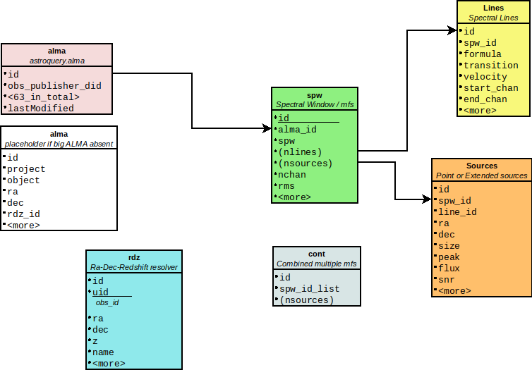

# Summary

ALMA and ADMIT data are queried together, but their tables are stored separately here.
In the mockdata universe we have alma.db and admit.db.

## Summary of the ALMA table

1. ALMA data has a *Project / Sous / Gous / Mous* hierarchy, or in database columns:
   1. 'proposal_id'
   2.  ???   (the Sous is often the target name in a survey)
   3. 'group_ous_uid'
   4. 'member_ous_uid'  (also:   'obs_id' - is that an accidental duplication?)

2. Each Mous is an observation with typically 4 spw's , and taking up 4 rows in the database.
   1. 'frequency_support' - a long string describing all SPW's, shared by all spw's in a MOUS
   2. 'frequency' - the mid freq of this record, this will identify which spw we have

   Note that the spw# is not recorded in the database. 
   
3. Each spw is disected by the ALMA pipeline in a 'cube'(line) and 'mfs' (continuum), 
   but often a comination 'cont' is also created. We normally ignore those in ADMIT.

        1. member.uid___A001_X1288_Xba8.NGC3504_sci.spw25.mfs.I.pbcor.fits
        2. member.uid___A001_X1288_Xba8.NGC3504_sci.spw25.cube.I.pbcor.fits
        3. member.uid___A001_X1288_Xba8.NGC3504_sci.spw19_21_23_25.cont.I.pbcor.fits
		
	There are also manually run MOUS, but they may not match the pattern we use (see below)

## Summary of ADMIT tables		

There are four tables for ADMIT:   spw (W), cont (C), source (S) and lines (L).

1. The "Admit After Pipeline" (AAP) script has a pattern of detecting pipeline products,
   and will run ADMIT on those "cube" or "mfs" products.  We store them in the same
   "spw" table with nchan > 1 differentiating between "cube" and "mfs".
   
2. Each "spw" can have 0 or more lines, and 0 or more sources. The sources
   are extracted with CubeSum in ADMIT, and each LineCube will also record
   what the flux in that source region is. This allows us to compare
   fluxes in the same source region through all LineCube's in a spw.
   Note that the sum of those do not have to be the same as
   the flux in the CubeSum!
   
3. The pipeline also records a combined continuum from all the mfs maps. We
   normally ignore those. Unlike the alma row, which has a 1-to-1 relationship
   to our spw table. We do have a "cont" table set aside for this, but we're
   not using it (yet).
   
4. Compared to the original design, where we assigned sources independantly to
   each LineCube, we decided in this final design to assign sources in the CubeSum,
   but carry them into the LineCube as a dependant.

## APPENDIX:  Sample ALMA database entry

Long keyword values are trimmed
 
    obs_publisher_did              ADS/JAO.ALMA#2017.1.00964.S
    obs_collection                 ALMA
    facility_name                  JAO                                     
    instrument_name                ALMA                                    
    obs_id                         uid://A001/X1288/Xba6                   
    dataproduct_type               cube                                    
    calib_level                    2                                       
    target_name                    NGC3504                                 
    s_ra                           165.7965954294555                       
    s_dec                          27.9724036111115                        
    s_fov                          0.006863718695429476                    
    s_region                       b'Circle ICRS 165.796595 27.972404 0.003432'
    s_resolution                   0.034121085407438106                    
    t_min                          58050.543677                            
    t_max                          58050.593452                            
    t_exptime                      2794.176                                
    t_resolution                   2794.176                                
    em_min                         0.0013017014810303316                   
    em_max                         0.0013123794888043588                   
    em_res_power                   204026.38849630405                      
    pol_states                     /XX/YY/                                 
    o_ucd                          phot.flux.density;phys.polarization
    access_url                     https://almascience.org/datalink/sync?ID=uid://A001/X1288/Xba6
    access_format                  applicati                               
    proposal_id                    2017.1.00964.S                          
    data_rights                    Public                                  
    gal_longitude                  204.6030009329745                       
    gal_latitude                   66.03998009734265                       
    band_list                      6                                       
    em_resolution                  338410371550841.06                      
    bandwidth                      1875000000.0                            
    antenna_arrays                 A007:DV09 A015:DA61 A027:DV06 ...
    is_mosaic                      F                                       
    obs_release_date               b'2018-11-29T18:49:04.000'              
    spatial_resolution             0.034121085407438106                    
    frequency_support              [226.56..228.55GHz,31250.00kHz,384.8uJy/beam@10km/s,23.7uJy/beam@native, XX YY] U 
	                               [228.43..230.31GHz,1128.91kHz,410.2uJy/beam@10km/s,26.2uJy/beam@native, XX YY] U 
								   [240.52..242.50GHz,31250.00kHz,428.5uJy/beam@10km/s,27.2uJy/beam@native, XX YY] U 
								   [242.77..244.75GHz,31250.00kHz,433.8uJy/beam@10km/s,27.7uJy/beam@native, XX YY]
    frequency                      229.37121211359016                      
    velocity_resolution            1469.3808002459973                      
    obs_creator_name               Nguyen, Dieu                            
    pub_title                      ALMACAL - VI. Molecular gas mass density across cosmic time ...
    first_author                   Kepley, Amanda A. Klitsch, Anne Nguyen, Dieu D.
    authors                        Kepley, Amanda A.; Tsutsumi, Takahiro; Brogan, Crystal L.; ...
    pub_abstract                   As part of the Measuring Black Holes in below Milky Way-mass ...
    publication_year               2019                                    
    proposal_abstract              We propose to use ALMA observations to make robust dynamical measurements ...
    schedblock_name                NGC3504_a_06_TM1                        
    proposal_authors               Greene, Jenny; Seth, Anil; Onishi, Kyoko; Nyland, Kristina; Nguyen, Phuong; ...
    sensitivity_10kms              0.41023623014294164                     
    cont_sensitivity_bandwidth     0.013024243494318813                    
    pwv                            0.7503407                               
    group_ous_uid                  uid://A001/X1288/Xba5                   
    member_ous_uid                 uid://A001/X1288/Xba6                   
    asdm_uid                       uid://A002/Xc5fe11/X4712                
    obs_title                      Weighing Black Hole Masses in Low-Mass Galaxies
    type                           S                                       
    scan_intent                    TARGET                                  
    science_observation            T                                       
    spatial_scale_max              0.916163907966946                       
    qa2_passed                     T                                       
    bib_reference                  2019MNRAS.490.1220K 2020ApJ...892...68N 2020PASP..132b4505K 2022MNRAS.509.2920N
    science_keyword                Surveys of galaxies, Galactic centres/nuclei
    scientific_category            Galaxy evolution                        
    lastModified                   b'2022-02-14T16:53:42.403'              

